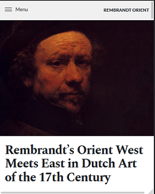
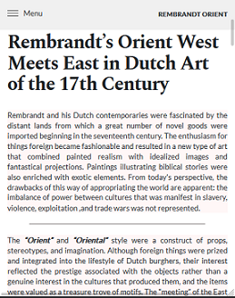
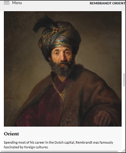
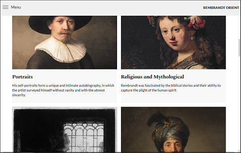
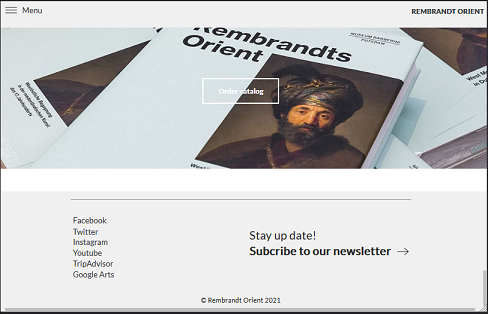

# Rembrandt orient

*Responsive home page website that covers the stylistic periods of the Dutch Painter Rembrandt, *
*in particular the Orient period.* 

 

## What I've used
* Html
* CSS
* Javascript
* ScrollReveal.js library https://scrollrevealjs.org/

  

## Responsive: small device  

 

## Responsive: large device  

  

### To see the project: rembrandt-orient.netlify.app
